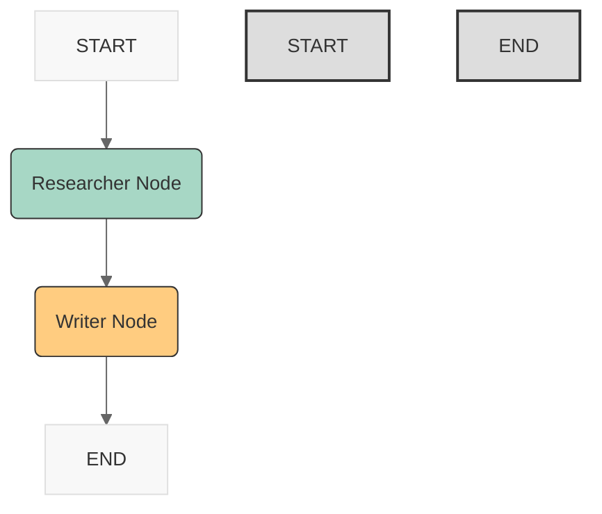

これまでの LangGraph のステップでは、グラフを使って処理の流れを制御する方法、特に条件によって進む道を変える「条件分岐」を学びましたね。今回はさらに一歩進んで、**複数の AI エージェント** が協力して一つのタスクをこなす、まるで専門家チームのような処理フローを **設計する** 方法を学びます。

例えば、「調査が得意なリサーチャー」と「文章を書くのが得意なライター」が、情報をバトンタッチしながら協力してレポートを作成する、といったイメージです。一人（単一エージェント）では難しい複雑なタスクも、役割分担されたチームならうまくいくかもしれません。LangGraph は、このような「エージェントチーム」の連携プレーを設計し、実現するための強力なツールになります。

このステップでは、実際にコードをたくさん書くのではなく、**どのようなチーム編成（エージェント構成）で、どのような連携プレー（ワークフロー）をさせるか、その「設計図」を描くことに集中します。** しっかり設計図を描くことで、次のステップでの実装がずっとスムーズになりますよ。

## 1. はじめに：このステップで目指すこと

### 🎯 今回のゴール

このステップを終えると、あなたはこんなことができるようになります！

- なぜ複数の AI エージェントを連携させる「チームプレー」が有効なのか、その理由とメリットを理解します。
- LangGraph を使って、異なる役割を持つ複数のエージェントが協力し合うワークフローを **設計** するための基本的な考え方（役割分担、状態共有、処理の流れ、エラー対策など）を学びます。
- **具体的な成果物:** 「ユーザーのリクエストに応じて、リサーチャーエージェントが情報を検索し、ライターエージェントが報告書を作成する」というシナリオについて、その**ワークフロー設計図**（エージェントの役割、共有する状態、グラフの構造、考慮すべき点）を作成します。

### 🔑 このステップのポイント

今回は「設計」がテーマなので、以下の考え方が特に重要になります。

- **マルチエージェントワークフロー**: 複数の自律的なエージェントが、共通の目標に向かって協力し合う処理の流れ。
- **役割分担**: 各エージェントにどのような専門性やタスクを担当させるか明確に決めること。
- **状態共有 (State Sharing)**: エージェント間で情報をスムーズに引き継ぐために、グラフの「状態 (State)」に何を含めるか設計すること。
- **遷移ロジック (Transition Logic)**: どのエージェントからどのエージェントへ、どのような条件で処理を移すか、その流れ（エッジ）を決めること。
- **(重要) 設計段階での考慮**: エラーが起きたらどうするか、セキュリティは大丈夫か、なども設計段階で考えておくこと。

### ✅ 前提知識

このステップの内容を理解するために、以下の知識があると役立ちます。

- **ステップ 33 までの LangGraph の基本**: `StateGraph`、状態 (`TypedDict`)、ノード、通常のエッジ、条件分岐エッジの基本的な概念を理解していること。
- **(推奨) ステップ 24〜27 あたりのエージェントの基本**: LangChain におけるエージェントがどのように動作するか（LLM がツールを使ってタスクを実行する）を知っていると、各エージェントの役割設計がしやすくなります。

---

## 2. 準備運動：ハンズオンのための基礎知識

### 🎯 目標

複数のエージェントを連携させるワークフローとは何か、そしてそれを LangGraph で設計する際の基本的な考え方を理解しましょう。

### マルチエージェントワークフローとは？ - AI のチームプレー

一つの AI エージェントが、Web 検索も、複雑な計算も、気の利いた文章作成も、すべて完璧にこなせたら理想的ですが、現実には得意不得意があります。そこで、「それぞれの得意技を持つ AI エージェントを集めてチームを作り、協力して大きな目標を達成させよう！」というのが **マルチエージェントワークフロー** の考え方です。

例えば、スポーツチームのように、調査が得意な「リサーチ担当」、分析が得意な「分析担当」、文章作成が得意な「レポート作成担当」といった役割を分担させるのです。

### LangGraph でのエージェント連携 - 作戦ボードとしての役割

LangGraph は、この AI チームの作戦ボードのような役割を果たします。

- **選手登録 (ノード)**: チームの各メンバー (エージェント) を、グラフの **ノード** として登録します。
- **情報共有 (状態)**: 選手間でパスされるボールのように、必要な情報をグラフの **状態 (State)** を使って共有・引き継ぎます。リサーチ担当が見つけた情報を状態に入れ、次のレポート作成担当がそれを受け取る、といった流れです。LangGraph では、この情報の受け渡しはグラフの実行順序に従って**同期的**に行われます（特別な非同期処理を組まない限り）。特別な通信方法ではなく、状態オブジェクトを介して情報が伝達されます。
- **プレーの指示 (エッジ)**: 誰から誰へパスを出すか (次にどのエージェントを呼ぶか)、状況に応じてフォーメーションを変えるか (条件分岐するか) を、**エッジ** で指示します。

### 設計のポイント：チームを成功させるために決めること

良いチームを作るには、良い設計が必要です。マルチエージェントワークフローを設計する際には、主に以下の点を考えましょう。

1.  **役割分担 (ポジション決め)**:
    - どんな専門家 (エージェント) が何人必要か？
    - それぞれの専門家は何をするのが役割か？ どんな道具 (ツール) が必要か？
2.  **情報共有のルール (パスワーク)**:
    - チーム全体で共有すべき情報は何か？ (最初の指示、途中のメモ、最終的な成果物など)
    - その情報を管理するための「状態 (State)」をどう設計するか？ (`TypedDict` でキーと型を定義)
3.  **プレーの流れ (フォーメーションと戦術)**:
    - 誰からプレーを始めるか？ (`START` からどのノードへ？)
    - ある選手のプレーが終わったら、次は誰にパスを出すか？ (通常のエッジ)
    - 状況によってパスの相手を変えるか？ (条件分岐エッジ)
    - いつプレーを終了するか？ (どのノードから `END` へ？)
4.  **(重要) ピンチへの備え (エラー対策)**:
    - もし誰かがミスしたら (処理が失敗したら) どうするか？ (やり直させる？ 別の選手に頼む？ 試合終了？)
5.  **(重要) ルールと安全 (セキュリティ)**:
    - チームで扱う情報の中に、秘密の情報や個人情報が含まれていないか？ 含まれる場合、どう安全に扱うか？

### 今回設計するシナリオ例

このステップでは、比較的イメージしやすい以下のシナリオのワークフローを**設計**してみましょう。

**シナリオ:** ユーザーが「〇〇について簡単なレポートを書いて」とリクエストする。
**チーム編成:**

- **リサーチャー**: 〇〇について Web で調べて要点をまとめる。
- **ライター**: リサーチャーの要約を元にレポートを書く。

---

## 3. 実践タイム：ワークフローを設計してみよう！

### 🎯 目標

上記のシナリオ「リサーチャーとライターの連携」について、LangGraph で実装することを見据えて、その **設計図** を作成します。**コーディングではなく、設計に集中しましょう！**

### 1. 役割定義 (エージェントの設計)

まず、チームメンバー（エージェント）のプロフィールを決めます。

- **メンバー 1: リサーチャー (Researcher)**
  - **得意技**: Web 検索で情報を集め、大事なポイントを抜き出すこと。
  - **役割**: 指示されたトピックについて Web で調べ、簡単なサマリーを作る。
  - **必要な道具**: Web 検索ツール (例: `DuckDuckGoSearchRun`)。
- **メンバー 2: ライター (Writer)**
  - **得意技**: 分かりやすい文章を書くこと。
  - **役割**: リサーチャーが作ったサマリーを元に、レポートとして体裁を整える。
  - **必要な道具**: 特になし (LLM の文章力を使う)。

### 2. 状態 (State) の設計

次に、チーム内で共有する「作戦ノート」(状態) の項目を決めます。

```python
# 状態の設計イメージ (Python の TypedDict を使う想定)
from typing import TypedDict, Optional

class ResearchWorkflowState(TypedDict):
    # 最初に必ず入ってくる情報
    request: str                # ユーザーからの最初の指示

    # 途中で書き込まれる情報
    research_summary: Optional[str] # リサーチャーが書く調査サマリー
    report: Optional[str]       # ライターが書く最終レポート

    # (オプション) もしエラーが起きたら記録する場所
    error_message: Optional[str]
```

- `request`: 最初の指示。
- `research_summary`: リサーチャーの結果。最初は空 (None) かもしれません。
- `report`: ライターの結果。これも最初は空 (None) かもしれません。
- `error_message`: 何か問題が起きたとき用。

### 3. グラフ構造 (ノードとエッジ) の設計

チームの動き方、つまり処理の流れを決めます。

- **登場人物 (ノード)**:
  - `researcher_node`: リサーチャーが仕事をする場所。
  - `writer_node`: ライターが仕事をする場所。
- **プレーの流れ (エッジ)**:
  - 今回はシンプルに、リサーチャーが終わったらライター、という**一直線の流れ**にします。
  - `START` (開始) → `researcher_node` (まずリサーチャー)
  - `researcher_node` → `writer_node` (リサーチャーからライターへパス)
  - `writer_node` → `END` (ライターが終わったら終了)

### 4. 処理フローの図示 (Mermaid 形式)

この設計を図にすると、以下のようになります。



_(この Mermaid コードを Mermaid Live Editor などに貼り付けると、START から Researcher, Writer を経て END に至るシンプルな流れが見えます。)_

---

## 4. 深掘り解説：設計の考慮点

### 🎯 目標

マルチエージェントワークフローを設計する際に、さらにどのような点に注意を払うと、より良い設計になるか、考え方のヒントを深掘りします。

### 状態設計の重要性 - パスは正確に

状態 (State) はエージェント間の情報のバトンです。

- **何を渡す？**: 後工程のエージェントが必要とする情報が、前の工程のエージェントから正しく状態に書き込まれているか、慎重に考える必要があります。「ライターはレポートを書くのに元のリクエスト内容も必要だよね」といった視点です。
- **名前は分かりやすく**: 状態のキー名 (`request`, `research_summary` など) は、誰が見ても何の情報か分かるようにしましょう。
- **シンプルに**: 必要以上に多くの情報を状態に入れようとすると、管理が複雑になります。本当に必要な情報を見極めましょう。

### 遷移ロジックのパターン - 戦術はいろいろ

今回は単純な A→B→C でしたが、実際のタスクに応じて流れは変わります。

- **条件分岐**: 「リサーチ結果がイマイチだったら、ライターに進まずにもう一度リサーチさせる」→ ステップ 33 で学んだ条件分岐エッジを使います。
- **並列処理**: 「リサーチと同時に、関連する画像も探し始める」→ LangGraph はノードの並列実行も可能ですが、少し応用的な使い方になります。
- **ループ**: 「レポートをユーザーに見せて、OK が出るまでライターに修正させる」→ 条件分岐を使ってループを作ります。

どんな流れが最も効果的か、タスクに合わせて設計します。

### エージェント自体の設計 - 選手の能力と指示

グラフの流れだけでなく、各ノードで動くエージェント自身がうまく機能することも大切です。

- **役割指示 (プロンプト)**: 各エージェントへの指示は明確ですか？「あなたは優秀なリサーチャーです。〇〇について、信頼できる情報源から要点を 3 つにまとめてください」のように具体的に指示します。
- **ツールの準備**: Web 検索が必要なら、検索ツールを使えるようにエージェントを設定する必要があります。

### ピンチへの備え - エラーハンドリングの設計

設計段階で「うまくいかなかったらどうするか」を考えておくことは、安定したシステムを作る上で非常に重要です。

- **ケースを想定**: 「リサーチャーが Web 検索で何も見つけられなかったら？」「ライターが意味不明な文章を生成したら？」といった具体的な失敗ケースを考えます。
- **対策を設計**:
  - **リトライ**: もう一度同じ処理を試みるノードを作る。
  - **代替処理**: 別の方法（別のエージェントやツール）を試すノードに分岐する。
  - **報告と終了**: エラーが発生したことを状態に記録し、処理を安全に終了させる。
    どの対策をとるかを、エラーの種類に応じて設計に組み込みます。

### ルールと安全 - セキュリティとプライバシーの考慮

エージェントが扱う情報には、注意が必要なものが含まれる可能性があります。

- **機密情報**: ユーザーの入力 (`request`) や検索結果 (`research_summary`) に、個人情報や社外秘の情報が含まれる可能性はないか？
- **対策の検討**: もし機密情報が含まれる可能性があるなら、設計段階で以下のような対策を検討する必要があります。
  - **マスキング**: 個人名や特定のキーワードを伏字にする処理をノードとして追加する。
  - **アクセス制御**: 特定のエージェントやユーザーしか情報にアクセスできないようにする（LangGraph 自体の機能というよりは、システム全体の設計）。
  - **情報保持期間**: 不要になった情報は状態から削除したり、ログを適切に管理したりする。
    安全なシステムの設計は非常に重要です。

### その他の設計考慮点

- **スケーラビリティ**: もしエージェントの数がもっと増えたり、処理するリクエストが大量になったりした場合、システム全体がうまく動作し続けるか？ パフォーマンスへの影響も少し考えておくと良いでしょう。
- **監視・ロギング**: 各エージェントがちゃんと動いているか、どこで時間がかかっているかなどを後から確認できるように、ログ（記録）を残す仕組みを設計に含めることも有効です。

---

## 5. 最終チェック：設計図は大丈夫？

### 🎯 目標

作成したワークフロー設計図に、考慮漏れや不明確な点がないか、チームメンバーに説明するつもりで見直してみましょう。

### 確認してみよう

- **役割**: リサーチャーとライターの役割分担は明確ですか？ 担当範囲が重なっていたり、抜けていたりしませんか？
- **状態**:
  - ライターが必要な情報はすべて状態に含まれていますか？
  - エラーが起きた時の情報も記録できますか？
- **フロー**:
  - 処理の開始から終了までの流れは明確ですか？
  - （今回は単純ですが）もし分岐やループが必要な場合、それは設計に含まれていますか？
  - エラーが発生した場合、どのように処理が終了しますか？（今回は明確には設計していませんが、考えるきっかけに）
- **全体**: この設計で、ユーザーのリクエストに応じたレポートを作成するという目的は達成できそうですか？

ここでしっかり設計を練っておくことが、次の実装ステップでの成功につながります。

---

## 6. まとめ：学びの整理と次へのステップ

### ✅ 達成したこと！

今回はコードを書かずに、頭の中で AI チームの連携プレーを組み立てる「設計」を行いました！

- 複数の AI エージェントを連携させる**マルチエージェントワークフロー**の考え方とその利点を理解しました。
- LangGraph を使った連携設計における**役割分担**、**状態共有**、**遷移ロジック**、そして**エラーハンドリング**や**セキュリティ**といった設計上の考慮点を学びました。
- 具体的なシナリオ（リサーチャーとライター）に基づいて、エージェントの役割、共有する状態、グラフの構造（ノードとエッジ）を**設計**しました。
- 実装前に設計をしっかり行うことの重要性を認識しました。

### 🔑 学んだキーワード

- **マルチエージェントワークフロー (Multi-Agent Workflow)**
- **役割分担 (Role Specialization)**
- **状態共有 (State Sharing)**
- **遷移ロジック (Transition Logic)**
- **ワークフロー設計 (Workflow Design)**
- **エラーハンドリング設計 (Error Handling Design)**
- **セキュリティ設計 (Security Design)**

### 🚀 次のステップへ！

素晴らしい設計図が描けましたね！ 次はいよいよ、この設計図に命を吹き込み、実際に LangGraph のコードを書いて、複数のエージェントが連携するワークフローを**実装**します。

次の **ステップ 35「LangGraph 応用(2): 複数エージェント連携実装」** では、今回設計したリサーチャーエージェントとライターエージェントを作成し、それらをノードとして LangGraph に組み込み、状態を共有しながら連携させて動かしてみます。設計が形になる瞬間を体験しましょう！ 設計段階で考えたことが、コードにどう反映されるかを見るのはとても面白いですよ。
